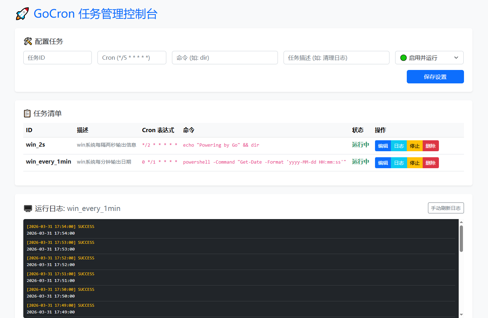

# GoCron - 高性能轻量级任务管理系统

GoCron 是一个基于 **Go (Gin)** 和 **Redis** 构建的轻量级定时任务管理平台。它支持秒级定时任务调度、实时日志捕获以及交互友好的 Web 操作界面。



## 一、 项目开发思路与架构设计

### 1. 架构设计图


- **Web 层 (Gin)**：提供 RESTful API 和静态页面。负责接收用户的“开启/暂停/删除/编辑”指令，并同步更新 Redis。
- **逻辑层 (Service/Scheduler)**：核心调度器。程序启动时从 Redis 加载所有任务；运行中通过单例模式管理内存中的 Cron 任务。
- **执行层 (Executor)**：使用 `os/exec` 在独立 Goroutine 中派生进程执行 Shell/Command，捕获输出并限流写入 Redis 日志。
- **存储层 (Redis)**：
    - `tasks:{id}` (Hash): 存储任务详情和状态。
    - `task_list` (Set): 存储所有任务 ID。
    - `logs:{id}` (List): 存储最近 N 条执行日志（利用 LTRIM 自动清理老日志）。

### 2. 核心健壮性设计
- **异步解耦**：API 操作先改 Redis，再通知调度器，不阻塞 HTTP 响应。
- **并发安全**：使用 `sync.Map` 或 `RWMutex` 保护内存中的任务句柄。
- **无损重启**：`main` 函数监听信号，退出前调用 `cron.Stop()` 等待任务收尾。

---

## 二、 项目目录结构

```text
gocron/
├── main.go                 # 入口文件（初始化、路由注册、优雅退出）
├── internal/
│   ├── model/
│   │   └── task.go         # 任务与日志结构体定义
│   ├── service/
│   │   ├── scheduler.go    # 调度引擎核心逻辑
│   │   └── redis_store.go  # Redis 交互逻辑
│   └── handler/
│       └── http_handler.go # Gin 路由处理函数
├── static/
│   └── index.html          # 管理前端界面（集成编辑、日志刷新交互）
├── go.mod
└── go.sum
```

---

## 三、 API 接口详情

### 1. 保存或更新任务 (Save/Update Task)
- **接口地址**: `/api/save`
- **请求方式**: `POST`
- **数据格式**: `application/json`
- **请求参数**:

| 字段 | 类型 | 必填 | 说明                               |
| :--- | :--- | :--- |:---------------------------------|
| `id` | string | 是 | 任务唯一标识（不可重复），如：`win_test`          |
| `expr` | string | 是 | Cron 表达式（支持秒级，如 `*/5 * * * * *`） |
| `command`| string | 是 | 待执行的系统命令或脚本路径，如：`echo "Powering by Go" && dir`                 |
| `status` | int | 否 | `1`: 启用并运行; `0`: 停止/禁用           |
| `timeout`| int | 否 | 任务执行超时时间（秒），默认 60s               |

### 2. 获取任务列表 (Get Task List)
- **接口地址**: `/api/tasks`
- **请求方式**: `GET`
- **功能描述**: 返回当前 Redis 中存储的所有任务元数据。

### 3. 获取执行日志 (Get Task Logs)
- **接口地址**: `/api/logs`
- **请求方式**: `GET`
- **请求参数**: `?id=任务ID`
- **功能描述**: 获取指定任务的流水记录，按时间倒序排列（最新在前）。
- **返回字段**: `start_time` (时间点), `success` (是否成功), `output` (控制台输出内容)。

### 4. 彻底删除任务 (Delete Task)
- **接口地址**: `/api/delete`
- **请求方式**: `GET`
- **请求参数**: `?id=任务ID`
- **关键动作**:
    - 立即从内存 Cron 引擎中移除该调度。
    - 物理删除 Redis 中的任务配置及其关联的所有日志列表。

---

## 四、 UI 交互与体验优化说明

* **编辑回填逻辑**：点击任务行蓝色填充的“编辑”按钮，数据自动回填至表单，锁定 ID 输入框为 `readOnly` 以防主键冲突，并自动平滑滚动至顶部。
* **日志间距压缩**：通过 CSS 极致压缩 `.log-item` 的内外边距，配合 JS `trim()` 过滤输出末尾的冗余空行，单屏信息展示密度大幅提升。
* **手动刷新 Loading**：日志刷新按钮集成 `Spinner` 状态。点击后按钮禁用并显示加载中，请求返回后自动恢复，解决点击无反馈的痛点。
* **日志自动置顶**：无论切换任务还是手动刷新，日志容器始终保持 `scrollTop = 0`，确保第一时间看到最新执行结果。

---

## 五、 环境要求与启动

* **环境**: Go 1.2x+ / Redis 6.0+
* **启动步骤**:
    1.  `go mod tidy`
    2.  `go run main.go`
    3.  访问 `http://localhost:8989`